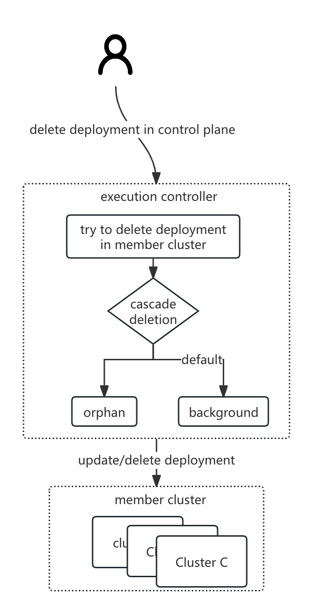

---
title: Use Cascading Deletion in Karmada

authors:
- "@CharlesQQ"

reviewers:
- "@robot"
- TBD

approvers:
- "@robot"
- TBD

creation-date: 2024-07-01

# Use Cascading Deletion in Karmada

## Summary
<!--
一种级联删除机制, 类似于[级联删除](https://kubernetes.io/docs/tasks/administer-cluster/use-cascading-deletion/)
-->
A cascading deletion mechanism, similar to [cascade deletion](https://kubernetes.io/docs/tasks/administer-cluster/use-cascading-deletion/)

## Motivation
<!--
默认情况下, 当用户删除Karmada控制面的资源模版之后,成员集群的资源也会被删除。但是仍然在某些场景下,用户希望仅仅删除控制面的资源,而保留成员集群资源
-->

By default, when the user deletes the resource template of the Karmada control plane, the resources of the member cluster will also be deleted. However,in some scenarios,users want to delete only the control plane resources and retain the member cluster resources;

### Goals
<!--
- 提供只删除控制面资源模板,而成员集群资源不删除,同时清理Karmada附加给成员集群资源的labels/annotations的能力
- 其他直接产生work对象的资源如cronfederatedhpa/federaredhpa/federatedresourcequota,需要有和资源模板相同的能力
- 提供karmadactl命令行,可以执行级联删除策略, 如 `karmadactl delete deployment --cascade=orphan`
-->

- Provides the ability to delete only the control plane resource templates without deleting the member cluster resources, and at the same time clean up the labels/annotations attached to the member cluster resources by Karmada.
- Other resources that directly generate work objects, such as namespace (ns-controller is turned on)/cronfederatedhpa/federaredhpa/federatedresourcequota, need to have the same capabilities as resource templates.
- Provides karmadactl command line to execute cascade deletion strategy, such as `karmadactl delete deployment --cascade=orphan`

### Non-Goals
<!--
- 不考虑不同的成员集群需要有不同的删除策略的情况
- 其他删除策略, 比如保留work对象
-->
- Does not consider the situation that different member clusters need different deletion strategies
- Other deletion strategies, such as retaining work objects

## Proposal

### User Stories (Optional)

#### Story 1
<!--
作为管理员，我希望在工作负载迁移到Karmada期间有一个回滚机制，以便在出现任何意外情况时可以恢复到迁移前的状态。
-->
As an administrator, I would like to have a rollback mechanism during workload migration to Karmada so that in case of any unexpected situation, I can revert to the pre-migration state.


### Notes/Constraints/Caveats (Optional)

### Risks and Mitigations

## Design Details

### Solution one: Extended by Annotation

#### API changes
<!--
- 为资源模板添加Annotation, 名称为: `resourcetemplate.karmada.io/cascadedeletion`
- 为了可扩展性,value应该是一个枚举类型
  - orphan: 删除work对象,清理Karmada附加给成员集群的workload的annotation/labels,不删除成员集群workload对象.
-->

- Since the object of the deletion operation is the resource template, add Annotation to the resource template, named: `resourcetemplate.karmada.io/cascadedeletion`
- For scalability, value should be an enum type
    - orphan: Delete the work object, clean up the annotation/labels of the workload attached by Karmada to the member cluster, and do not delete the member cluster workload object.

<!--
- 用户触发删除动作
- execution-controller 根据级联删除策略执行相应的动作
  
-->

- User triggers deletion action
- execution-controller performs corresponding actions according to the cascade deletion policy
  

#### User usage example
<!--
设置级联删除策略为orphan
-->
Set the cascade deletion policy to orphan

```yaml
apiVersion: apps/v1
kind: Deployment
metadata:
  annotations:
    propagationpolicy.karmada.io/name: foo
    propagationpolicy.karmada.io/namespace: default
    resourcetemplate.karmada.io/cascadedeletion: orphan
```

### Solution two: Extend the fields of PropagationPolicy/ClusterPropagationPolicy
<!--
通过扩展`PropagationPolicy/ClusterPropagationPolicy` API,引入一个新的字段`cascadedeletion`, 字段会被透传到`ResourceBinding/ClusterResourceBinding`以及 work对象,最后由execution controller根据work字段的值决定级联删除策略
缺点是部分直接生成work对象的资源如namespace/CRD/federatedresourcequota等, 没有`PropagationPolicy/ClusterPropagationPolicy`资源
-->

By extending the `PropagationPolicy/ClusterPropagationPolicy` API, a new field `cascadedeletion` is introduced. The field will be transparently transmitted to `ResourceBinding/ClusterResourceBinding` and the work object. Finally, the execution controller determines the cascade deletion strategy based on the value of the work field.
The disadvantage is that some resources that directly generate work objects, such as namespace/CRD/federatedresourcequota, etc., do not have `PropagationPolicy/ClusterPropagationPolicy` resources.

### API changes

PropagationPolicy/ClusterPropagationPolicy
```go
type CascadeDeletionPolicy string

const (
    // CascadeDeletionPolicyOrphan Orphans the dependents.
    CascadeDeletionPolicyOrphan CascadeDeletionPolicy = "orphan"
)

// PropagationSpec represents the desired behavior of PropagationPolicy.
type PropagationSpec struct {
	...
	//CascadeDeletion Declare the cascade deletion strategy. The default value is null, which is equivalent to background.
	// +optional
	CascadeDeletion *CascadeDeletionPolicy `json:"cascadeDeletion,omitempty"`
}
```

ResourceBinding/ClusterResourceBinding
```go
// ResourceBindingSpec represents the expectation of ResourceBinding.
type ResourceBindingSpec struct {
  ...
  //CascadeDeletion Declare the cascade deletion strategy. The default value is null, which is equivalent to background.
  // +optional
  CascadeDeletion *CascadeDeletionPolicy `json:"cascadeDeletion,omitempty"`
}
```
Work
```go
// WorkSpec defines the desired state of Work.
type WorkSpec struct {
    //CascadeDeletion Declare the cascade deletion strategy. The default value is null, which is equivalent to background.
    // +optional
    CascadeDeletion *CascadeDeletionPolicy `json:"cascadeDeletion,omitempty"` 
    // Workload represents the manifest workload to be deployed on managed cluster. 
    Workload WorkloadTemplate `json:"workload,omitempty"`
}
```

#### User usage example

Set the cascade deletion policy to orphan
```yaml
apiVersion: policy.karmada.io/v1alpha1
kind: PropagationPolicy
metadata:
  name: nginx-propagation
spec:
  resourceSelectors:
    - apiVersion: apps/v1
      kind: Deployment
      name: nginx
  cascadeDeletion: orphan
```
### Solution Three: Extended by adding new CRD
<!--
通过CRD定义控制面资源级联删除的策略, 好处是无需对PP和RB的字段进行扩展
在控制面资源生成work对象的时候, 根据CascadeDeletionPolicy的级联删除策略设置work的spec.cascadeDeletion字段内容
-->

Define the policy for cascading deletion of control plane resources through CRD. The advantage is that there is no need to expand the fields of PP and RB.
When the control plane resource generates a work object, set the spec.cascadeDeletion field content of the work according to the cascade deletion policy of CascadeDeletionPolicy.
### API changes

```go
type CascadeDeletionPolicy struct {
	metav1.TypeMeta   `json:",inline"`
	metav1.ObjectMeta `json:"metadata,omitempty"`

	// Spec represents the desired cascadeDeletion Behavior.
	Spec CascadeDeletionSpec `json:"spec"`

	// Status represents the status of cascadeDeletion.
	// +optional
	Status CascadeDeletionStatus `json:"status,omitempty"`
}

type CascadeDeletionSpec struct {
	//CascadeDeletion Declare the cascade deletion strategy. The default value is null, which is equivalent to background.
	// +optional
	CascadeDeletion *CascadeDeletionPolicy `json:"cascadeDeletion,omitempty"`
    // ResourceSelectors used to select resources.
    // Nil or empty selector is not allowed and doesn't mean match all kinds
    // of resources for security concerns that sensitive resources(like Secret)
    // might be accidentally propagated.
    // +required
    // +kubebuilder:validation:MinItems=1
    ResourceSelectors []ResourceSelector `json:"resourceSelectors"`
}

// ResourceSelector the resources will be selected.
type ResourceSelector struct {
    // APIVersion represents the API version of the target resources.
    // +required
    APIVersion string `json:"apiVersion"`
    
    // Kind represents the Kind of the target resources.
    // +required
    Kind string `json:"kind"`
    
    // Namespace of the target resource.
    // Default is empty, which means inherit from the parent object scope.
    // +optional
    Namespace string `json:"namespace,omitempty"`
    
    // Name of the target resource.
    // Default is empty, which means selecting all resources.
    // +optional
    Name string `json:"name,omitempty"`
    
    // A label query over a set of resources.
    // If name is not empty, labelSelector will be ignored.
    // +optional
    LabelSelector *metav1.LabelSelector `json:"labelSelector,omitempty"`
}

type CascadeDeletionStatus struct {
	...
}
```


Work
```go
// WorkSpec defines the desired state of Work.
type WorkSpec struct {
    //CascadeDeletion Declare the cascade deletion strategy. The default value is null, which is equivalent to background.
    // +optional
    CascadeDeletion *CascadeDeletionPolicy `json:"cascadeDeletion,omitempty"`
	// Workload represents the manifest workload to be deployed on managed cluster.
	Workload WorkloadTemplate `json:"workload,omitempty"`
}
```
#### User usage example

Set the cascade deletion policy to orphan

```yaml
apiVersion: policy.karmada.io/v1alpha1
kind: CascadeDeletionPolicy
metadata:
  name: foo
spec:
  cascadeDeletion: orphan
  resourceSelectors:
    - apiVersion: apps/v1
      kind: Deployment
      name: foo
      namespace: default
```

### Solution Four: Extended by Annotation & Extend the fields of PropagationPolicy/ClusterPropagationPolicy

Equivalent to supporting both solution one and solution two

### Solution comparison
| Name           | Supported control plane resources | Extend API resources | User learning cost |
|----------------|-----------------------------------|----------------------|--------------------|
| Solution One   | all resources                     | None                 | lowest             |
| Solution Two   | resource template                 | PP/CPP/RB/CRB/WORK   | lowest             |
| Solution Three | all resources                     | new CRD/WORK         | Highest            |
| Solution Four  | all resources                     | PP/CPP/RB/CRB/WORK   | lower              |

Solution One:
Disadvantages:
- When the execution-controller determines whether to cascade delete resources in the member clusters, it needs to parse the resources in the Work template from the manifest, which adds an extra parsing overhead.

Solution Two:
Disadvantages:
- For resources that are not distributed through PropagationPolicy, such as namespace, federatedresourcequota, it is not possible to specify a deletion policy.

### The cascading deletion policy of dependent resources and main resources does not force binding
<!--
依赖资源和主资源的级联删除策略不强制绑定
由于依赖资源可能被多个资源模版共享,在这种情况下很难决策依赖资源的删除策略以哪个删除策略为准; 不强制和主资源绑定,由用户自己决策,灵活性和扩展性更好
-->
Since dependent resources may be shared by multiple resource templates, in this case it is difficult to decide which deletion strategy should be used for the dependent resources; it is not forced to be bound to the main resource, and is left to the user to decide, with greater flexibility and scalability. good

### The cascade deletion strategy for namespace and CRD resources is still specified by the user.
<!--
namespace和CRD资源的级联删除策略由用户依然由用户指定
在execution节点区分workload的类型成本较高; 另外区分这两种资源的级联删除策略会带来用户学习成本; 如果用户有需求保留成员集群namespace和CRD资源,可以说明修改级联删除策略为orphan, 这样可以和资源模版的策略保持一致
-->

The cost of distinguishing the workload type on the execution node is high; in addition, the cascade deletion strategy that distinguishes these two resources will bring user learning costs; if the user needs to retain the member cluster namespace and CRD resources, it can be explained that the cascade deletion strategy is modified to orphan , so that it can be consistent with the strategy of the resource template

### karmadactl adds command line parameters related to cascade deletion
<!--
karmadactl 增加级联删除相关的命令行参数
- `karmadactl delete deployment <name> --cascade=orphan` 给资源增加级联删除策略并删除资源
-->

`karmadactl delete deployment <name> --cascade=orphan` adds a cascade deletion policy to the resource and deletes the resource


QA: When cascade=orphan, whether the workload of the member cluster only clears the `karmada.io/managed` label is enough

### Test Plan

TODO

## Alternatives