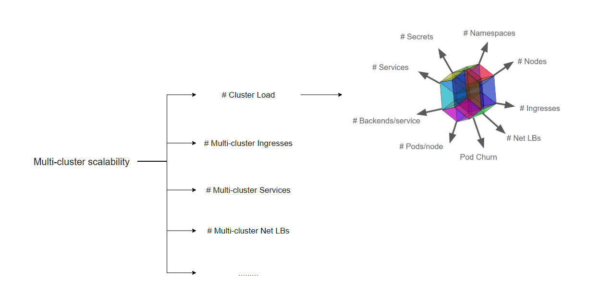

# Abstract

# Backgroud

# Introduction to Karmada

# SLIs/SLOs

可扩展性和性能是多集群联邦的重要特性，作为多集群联邦的用户，我们期望在以上两方面有服务质量的保证。在进行大规模性能测试之前，我们需要定义测量指标。在参考了Kubernetes社区的SLI(Service Level Indicator)/SLO(Service Level Objectives)和多集群的典型应用，Karmada社区定义了以下SLI/SLO来衡量多集群联邦的服务质量。

1. API Call Latency
   
对于联邦控制面内的资源，包括用户提交的需要下发到成员集群的资源模板、调度策略等：

| Status                      | SLI                                   | SLO |
| ------------------------- | ----------------------------------------------- | ----- |
| Offical    | 最近5min的单个Object Mutating API P99 时延                   | 除聚合API和CRD外, P99 <= 1s |
| Offical    | 最近5min的non-streaming read-only P99 API时延                 | 除聚合API和CRD外, Scope=resource, P99 <= 1s, Scope=namespace, P99 <= 5s, Scope=cluster, P99 <= 30s|

对于成员集群内的资源：

| Status                      | SLI                                   | SLO |
| ------------------------- | ----------------------------------------------- | ----- |
| Offical    | 最近5min的单个Object Mutating API P99 时延                   | 除聚合API和CRD外, P99 <= 1s |
| Offical    | 最近5min的non-streaming read-only P99 API时延                 | 除聚合API和CRD外, Scope=resource, P99 <= 1s, Scope=namespace, P99 <= 5s, Scope=cluster, P99 <= 30s|

2. Cluster Startup Latency

| Status                      | SLI                                   | SLO |
| ------------------------- | ----------------------------------------------- | ----- |
| Offical    | 集群从接入联邦控制面到状态能被控制面正确收集的时间，不考虑控制面与成员集群之间的网络波动                   | X |

3. Pod Startup Latency

| Status                      | SLI                                   | SLO |
| ------------------------- | ----------------------------------------------- | ----- |
| Offical    | 用户在联邦控制面提交资源模板和下发策略后到无状态Pod在成员集群的启动延时，不考虑控制面与成员集群之间的网络波动但考虑单集群的Pod启动延时                   | X |

4. Resource usage

| Status                      | SLI                                   | SLO |
| ------------------------- | ----------------------------------------------- | ----- |
| WIP    | 在接入一定数量的集群后集群联邦维持其正常工作所必需的资源使用量                   | X |

# Karmada Scalability Dimensions and Thresholds

Karmada的可伸缩特性不单指集群规模，即Scalability!=#cluster, 实际上Karmada可伸缩性包含很多维度的测量，不仅包含单集群内namespace数量、Pod数量、service等单集群内的度量指标，还包括多集群规模、多集群网络等联邦层面的测量标准。



Karmada集群联邦无限制扩展集群规模和单集群资源对象而且又满足SLIs/SLOs各项指标显然是不可能实现的，在单集群场景下业界定义了Kubernetes多个维度资源上限。
```
1. Pods/node 30
2. Backends <= 50k & Services <= 10k & Backends/service <= 250
3. Pod churn 20/s
4. Secret & configmap/node 30
5. Namespaces <= 10k & Pods <= 150k & Pods/namespace <= 3k
```

多集群场景下各个维度会按集群数量继续进行拉伸，并且包括集群数量在内的各个维度不是完全独立的，某个维度被拉伸相应的其他维度就要被压缩。例如在100集群下将单集群的5k 节点拉伸到10k node的场景或者在单集群规格不变的同时扩展集群数量到200集群，其他维度的规格势必会受到影响。
如果各种场景都进行测试分析工作量是非常巨大的，在本次测试中，我们会重点选取典型场景配置进行测试分析。在满足SLIs/SLOs的基础上，实现单集群支持5k节点，20k pod规模管理的100规模的集群接入和管理。

