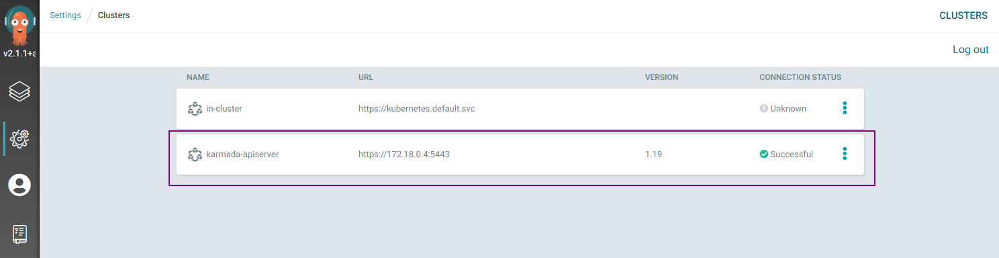
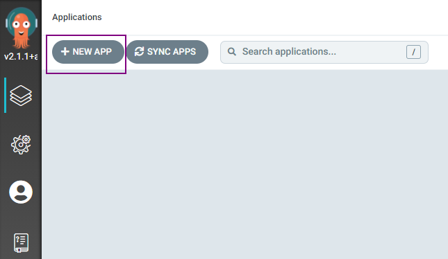
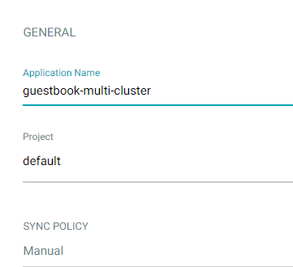
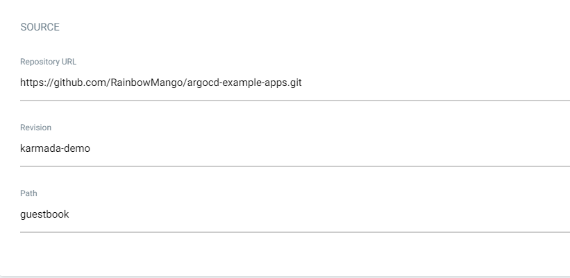
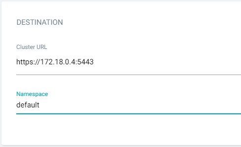
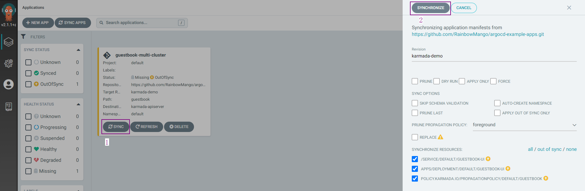
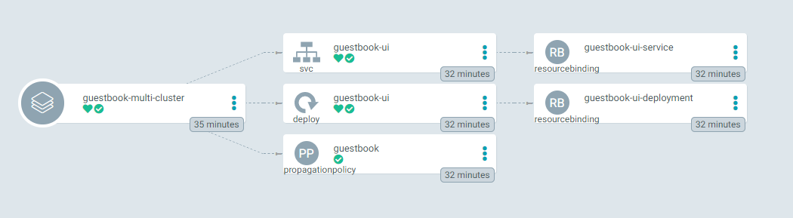
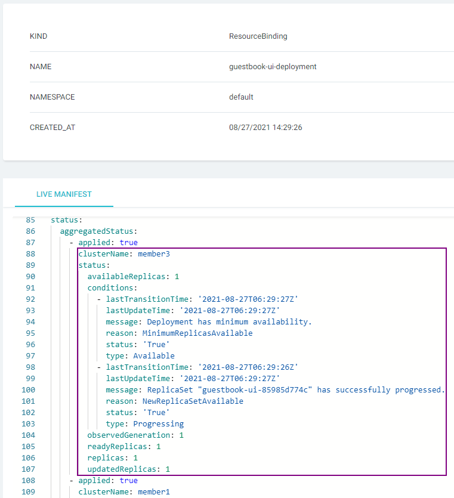
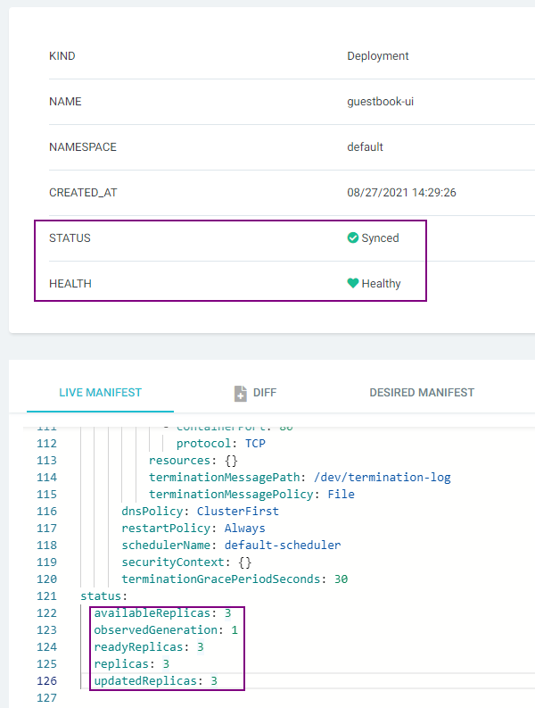

# Working with Argo CD

This topic walks you through how to use the [Argo CD](https://github.com/argoproj/argo-cd/) to manage your workload 
`across clusters` with `Karmada`.

## Prerequisites
### Argo CD Installation
You have installed Argo CD following the instructions in [Getting Started](https://argo-cd.readthedocs.io/en/stable/getting_started/#getting-started).

### Karmada Installation
In this example, we are using a Karmada environment with at lease `3` member clusters joined.

You can set up the environment by `hack/local-up-karmada.sh`, which is also used to run our E2E cases.

```bash
# kubectl get clusters
NAME      VERSION   MODE   READY   AGE
member1   v1.19.1   Push   True    18h
member2   v1.19.1   Push   True    18h
member3   v1.19.1   Pull   True    17h
```

## Registering Karmada to Argo CD
This step registers Karmada control plane to Argo CD.

First list the contexts of all clusters in your current kubeconfig:
```bash
kubectl config get-contexts -o name
```

Choose the context of the Karmada control plane from the list and add it to `argocd cluster add CONTEXTNAME`. 
For example, for `karmada-apiserver` context, run:
```bash
argocd cluster add karmada-apiserver
```

If everything goes well, you can see the registered Karmada control plane from the Argo CD UI, e.g.:



## Creating Apps Via UI

### Preparing Apps
Take the [guestbook](https://github.com/argoproj/argocd-example-apps/tree/53e28ff20cc530b9ada2173fbbd64d48338583ba/guestbook) 
as example.

First, fork the [argocd-example-apps](https://github.com/argoproj/argocd-example-apps) repo and create a branch 
`karmada-demo`.

Then, create a [PropagationPolicy manifest](https://github.com/RainbowMango/argocd-example-apps/blob/e499ea5c6f31b665366bfbe5161737dc8723fb3b/guestbook/propagationpolicy.yaml) under the `guestbook` directory.

### Creating Apps

Click the `+ New App` button as shown below:



Give your app the name `guestbook-multi-cluster`, use the project `default`, and leave the sync policy as `Manual`:



Connect the `forked repo` to Argo CD by setting repository url to the github repo url, set revision as `karmada-demo`, 
and set the path to `guestbook`:



For Destination, set cluster to `karmada` and namespace to `default`:



### Syncing Apps
You can sync your applications via UI by simply clicking the SYNC button and following the pop-up instructions, e.g.:



More details please refer to [argocd guide: sync the application](https://argo-cd.readthedocs.io/en/stable/getting_started/#7-sync-deploy-the-application).

## Checking Apps Status
For deployment running in more than one clusters, you don't need to create applications for each 
cluster. You can get the overall and detailed status from one `Application`.



The `svc/guestbook-ui`, `deploy/guestbook-ui` and `propagationpolicy/guestbook` in the middle of the picture are the 
resources created by the manifest in the forked repo. And the `resourcebinding/guestbook-ui-service` and 
`resourcebinding/guestbook-ui-deployment` in the right of the picture are the resources created by Karmada.

### Checking Detailed Status
You can obtain the Deployment's detailed status by `resourcebinding/guestbook-ui-deployment`. 



### Checking Aggregated Status
You can obtain the aggregated status of the Deployment from UI by `deploy/guestbook-ui`.

